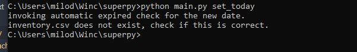

# SuperPy Manual

Welcome to the SuperPy manual, below are a list of all the commands

### All commands

1. buy
2. sell
3. set today
4. advance date
5. recede date
6. set given date
7. check date
8. inventory
9. revenue
10. profit
11. check expired
12. export to excel sheet

### Commands explained

Using your cli of choice navigate to the folder where the program is located e.g: *users/documents/superpy/*

you can also check the help messages by typing any command followed by -h: `python main,py buy -h`

***Please make sure that the order in which you give the arguments is exactly like the example.***

### Buy

`python main.py buy apple 2.0 2022-12-03`

##### Breakdown:

1. `python main.py` mandatory part that tells the pc to use python to run the main.py file
2. `buy` - this specifies the action you want to take, in this case buying.
3. `apple` - this is the name of the item you want to buy (string)
4. `2.0` - this is the price for which the item was bought (float)
5. `2022-12-03` - this is the expiration date (string)

##### Aliasses:

instead of typing buy, you could also use the `-b` alias:
`python main.py -b apple 2.0 2022-12-03`

### Sell

`python main.py sell apple 4.0`

##### Breakdown:

1. `python main.py` - check the buy command if you need an explanation.
2. `sell` - sepcifying you want to sell an item
3. `apple` - name of the item that you want to sell
4. `4.0` - price for which you sell the item

##### Aliasses:

`s`

##### Remarks

If you have multpiples of an item in stock, the one which expires the first will be sold first (first in first out).

### Set Today

`python main.py set_today`
This will set the percieved date, the date which the program percieves as today, to today's date.

##### Aliasses

`st`

##### remarks

it's good practice to do ths first everytime you "start up the program", unless you need to backlog something.

### Advance Date

`python main.py advance_date 2`
this will advance the date by any number of days you provide. in the case above two days.

##### Aliasses

`da`

### Recede Date

`python main.py recede_date 2`
this is the same as advance date, but it recedes it instead.

##### Aliasses

`dr`

### Set given date

`python main.py set_given_date 2022-12-31`
this will set the date to any date you put in, make sure you follow this format: yyyy-mm-dd

##### Aliasses

`ds`

### Check date

`python main.py check_date`
this will show wich date is stored as "today"

##### Aliasses

`dch`

### Inventory

`python main.py inventory`
This returns a tabel with the current inventory

##### Aliasses

`i` `inv`

### Revenue

`python main.py revenue -t month -d december`
this will return the revenue for any given month year or date.

##### Remarks

the `-t` argument stands for type, this will allow you to specify wether you want to get the revenue over a month, year or date. the `-d` argument lets you specify which month, year or date you want. If you want to get the total revenue so far, you can omit these arguments.

##### Aliasses

`r`

### Profit

`python main.py profit -t month -d december`
this will return the profit for any given month year or date.

##### Remarks

the `-t` argument stands for type, this will allow you to specify wether you want to get the profit over a month, year or date. the `-d` argument lets you specify which month, year or date you want. If you want to get the total profit so far, you can omit these arguments.

#### Aliasses

`p`

### Check for expired

`python main.py check_for_expired`
this will check if there are any items that are expired in your inventory.
This function is run automatically as well when you advance the date.

##### Aliasses

`c`

### Export to excel sheet

`python main.py export`
this will export all the csv files to their own sheet in one excel workbook.

##### Aliases

`e` `exp`

## Real life examples

### No Backlog

Let's say you want to buy something today, it is good practice to run the command `set_today` to make sure the date is set to today:
`python main.py set_today`

*since this is the first time starting the program there is no inventory file yet hence the message*

now you can continue and make the purchase(s)

### Backlog
So we bought 2 items and in the [bought.csv](..\bought.csv) we can see the bought_date is set to 2022-11-11.

2022-11-11 was a friday, and just around closing time a costumer came and bought the pear, you had already shut down the pc so you made a note with the selling price of 1.75. It is now monday and you were closed for the weekend, you already did some things with the program so the date is already set to monday the 14th of november. yo can chek to make sure by running the `check_date` command.

Now you would like to process the selling action that took place on friday. First set the date to friday's date(i ran the `check_date` just to be sure it worked):

now sell the pear:

### setting a given date in the future.
if you want to change the date percieved as today to a date in the future you can do this in multiple ways.

1. `set_given_date`
2. `advance_date`

if it is just a couple of days it is easiest to use `advance_date`, this will also run the `check_expired` function to check for expired items in the inventory.
When you need to change the date to further in the future(e.g afte a holiday) and it is a hassle to calcculate the ammount of days, it is best to use `set_given_date` however you will have to run the `check_expired` commmand manually:

as you can see the ananas has expired and thus is removed from the inventory and written to the [expired.csv](..\expired.csv)

### reporting and exporting

#### reporting
you can run reports to get the revenue or profit or get a table with the current inventory:

for both revenue an profit you have the opitions to specify a month, year or date of which you would like to know the profit/revenue:

#### export
you can export the .csv files into 1 single excel workbook by using the `export` command, it creates a file in the [export](../export/) folder and automatically opens it with you standard xslx program. the filename will contain the date on which the file was exported. At the moment you cannot overwrite exports, so if you want to make a new export on the same date you will have to rename or remove the old export.

### Help
each command also has its own help page, you can see by using the -h after the command:
`python main.py buy -h`
`python main.py report -h`
....

